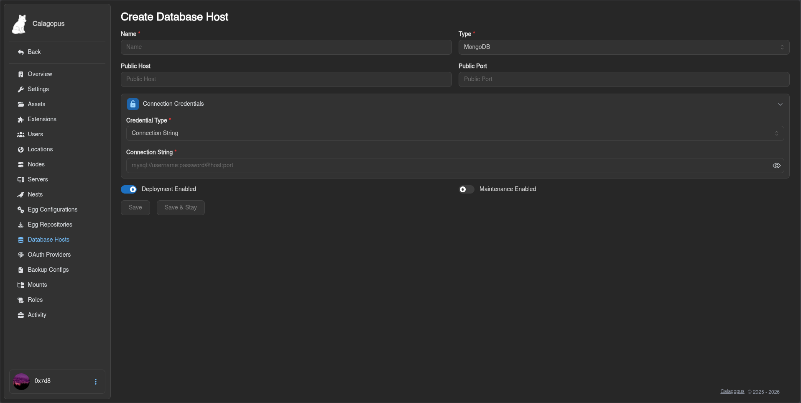
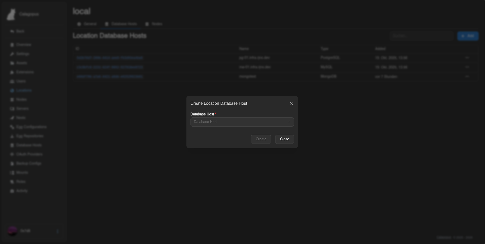

# MongoDB

This guide explains how to install and configure a **MongoDB** database server to use as a database host in the Calagopus Panel. Once set up, your users will be able to create MongoDB databases for their game servers directly from the panel.

::: info
The panel connects using a connection string and a privileged account to provision databases and users on demand. Each game server then receives its own isolated credentials.
:::

::: warning
MongoDB starts **without authentication enabled** by default. This guide walks you through creating a superuser first and then enabling authentication - do not skip this step.
:::

## Installation

::::tabs
=== Docker Compose

Create a directory for the service and enter it:

```bash
mkdir mongodb && cd mongodb
```

Create a `compose.yaml` with the following content. Authentication is intentionally disabled at first so you can create the initial superuser:

```yaml
services:
  mongodb:
    image: mongo:11
    restart: unless-stopped
    volumes:
      - ./data:/data/db
    ports:
      - "0.0.0.0:27017:27017"
```

Start the service:

```bash
docker compose up -d
```

Open a `mongosh` shell inside the container:

```bash
docker compose exec mongodb mongosh
```

=== APT (Debian / Ubuntu)

Follow the [official MongoDB installation guide for Debian/Ubuntu](https://www.mongodb.com/docs/manual/administration/install-community/?linux-distribution=ubuntu&linux-package=default&operating-system=linux&search-linux=with-search-linux) to add the MongoDB repository and install the package, then enable and start the service:

```bash
sudo systemctl enable --now mongod
```

Connect with `mongosh`:

```bash
mongosh
```

=== RPM (RHEL / Fedora / Rocky / Alma)

Follow the [official MongoDB installation guide for RHEL/Fedora](https://www.mongodb.com/docs/manual/administration/install-community/?linux-distribution=red-hat&linux-package=default&operating-system=linux&search-linux=with-search-linux) to add the MongoDB repository and install the package, then enable and start the service:

```bash
sudo systemctl enable --now mongod
```

Connect with `mongosh`:

```bash
mongosh
```

::::

## Creating the Superuser

Before enabling authentication, you must create an admin account. Inside the `mongosh` shell:

::: danger
This account can connect from **any IP address**. Use a long, randomly generated password - a weak password on an exposed port is a critical security risk.
:::

```js
use admin

db.createUser({
  user: "calagopus",
  pwd: "<strong-password>",
  roles: [
    { role: "userAdminAnyDatabase", db: "admin" },
    { role: "dbAdminAnyDatabase", db: "admin" },
    { role: "readWriteAnyDatabase", db: "admin" }
  ]
})
```

Exit the shell:

```js
exit
```

## Enabling Authentication

With the superuser created, restart MongoDB with authentication enforced.

::::tabs
=== Docker Compose

Update your `compose.yaml` to pass the `--auth` flag:

```yaml
services:
  mongodb:
    image: mongo:11
    restart: unless-stopped
    command: ["--auth"]
    volumes:
      - ./data:/data/db
    ports:
      - "0.0.0.0:27017:27017"
```

Restart the service:

```bash
docker compose up -d
```

=== APT / RPM

Edit `/etc/mongod.conf` and update the security section:

```yaml
security:
  authorization: enabled
```

Restart MongoDB:

```bash
sudo systemctl restart mongod
```

::::

Verify that authentication is working:

```bash
mongosh --username calagopus --password --authenticationDatabase admin
```

## Configuring Remote Access

By default, MongoDB only listens on `127.0.0.1`. To accept connections from the panel and Wings nodes, update the bind address.

::: info
If you used Docker Compose, the `ports` entry already handles exposure - skip this section.
:::

Edit `/etc/mongod.conf`:

```yaml
net:
  bindIp: 0.0.0.0
```

Restart MongoDB:

```bash
sudo systemctl restart mongod
```

## Adding the Host to the Panel

The panel uses a **connection string** to connect to MongoDB.

1. Go to **Admin → Database Hosts → Create**.
2. Select **MongoDB** as the database type.
3. Enter the connection string:

```text
mongodb://calagopus:<strong-password>@<host>:27017/?authSource=admin
```

Replace `<strong-password>` with the password you set and `<host>` with the IP address or hostname of the database server.



4. Click **Save**. You will be able to verify the connection afterwards.

## Making the Database Host Show Up for Users

By default, new database hosts are not visible to any client API endpoints, to fix this, we need to add the database host to the Locations Database Host List.

1. Go to **Admin → Locations** and click on the location you want to add the database host to.
2. Click the **Database Hosts** tab at the top.
3. Click **Add** and select the database host you just created from the dropdown, then submit.



::: info
For further reference on MongoDB configuration and user management, see the [official MongoDB documentation](https://www.mongodb.com/docs/).
:::
